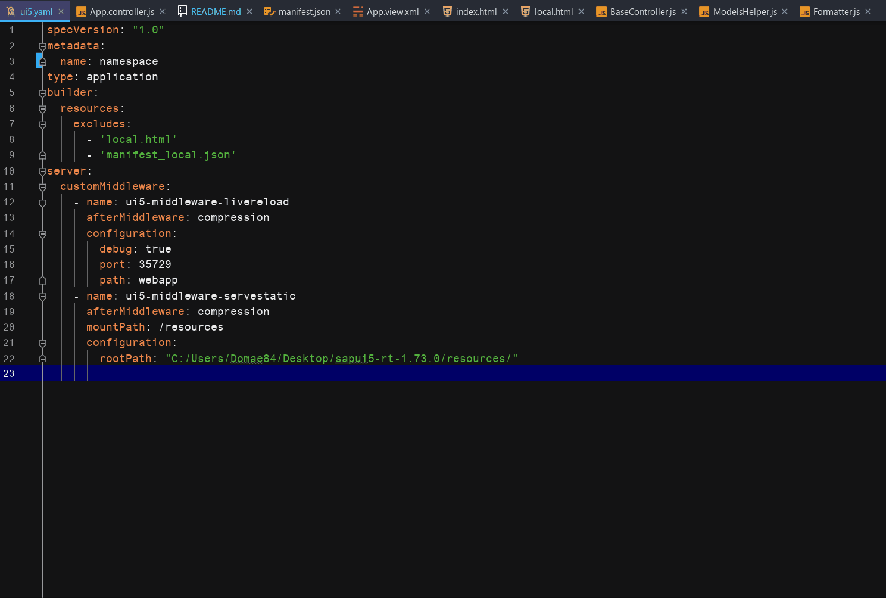

# UI5 Baseproject
This is a base folder skeleton to quickly start with local UI5
development. It comes with some features like:
* A ui5.yaml config with "serve-static" and "liveReload" middleware
* A complete basic folder structure
* A BaseController with a lot of handy functions
* A Backend-Service-Module with handy ajax functions
* A predefined OData-Model and JSON-Model
* Some predefined i18n texts
* An Error-Handler-Module to intercept all OData-Errors
* A Validator-Module for checking forms (Thx to Robin Van Het Hof
  [Github](https://github.com/qualiture/ui5-validator))
* Grunt configuration for deploying your app to a SAP Gateway Server
* Eslint configuration
* JsDoc configuration with a nice template
* A lot more..

### System Settings
* OS: **Windows 10**
* Browser: **Google Chrome**

### Prerequisites

* NodeJs (latest lts)
* Grunt (latest)
* @ui5/cli (latest)

### Installation

1. Download and Install [NodeJs](https://nodejs.org/en/download/)
2. Install Grunt globally with `npm i -g grunt`
3. Install the UI5 command line interface globally with `npm i -g
   @ui5/cli`
4. Install all devDependencies with `npm i`
4. Download a [SAPUI5 runtime](https://tools.hana.ondemand.com/#sapui5)
   (scroll down on that side) and extract it somewhere

### Post-Installation Steps

#### UI5.yaml
##### Namespace 
In your UI5.yaml you have to specify the namespace of your app under
*name* like so: 

##### Serve-Static Middleware (Optional)
If you want to use the **_serve-static-middleware_**, which allows you
to load the *sap-ui-core.js* locally from your machine, you have to
specify the path to where you extract the SAPUI5 runtime like so:

#### Adding a Namespace to your Project
When you are working with SAPUI5 you need to define a namespace for your
app. There are a lot of places where you have to specify this namespace
e.g. the index.html, the manifest.json or in all the modules and
controllers like the Component.js or the BaseController.js. Here is a
list where you have to edit the namespace, so that the project works
fine (search for the string _namespace_ to know where to exactly change
it):
* controller/App.controller.js
* controller/BaseController.js
* model/ModelsHelper.js
* services/BackendCommunicationService.js
* util/Errorhandler.js
* Component.js
* index.html
* local.html
* manifest.json
* manifest_local.json

Here are two examples of how to specify the namespace in your project.

##### index.html

##### BaseController.js

#### Specifying the OData-Service
If you already have an OData-Service, which you can consume in your app,
then you have to enter the path to the service in the _manifest.json_
and _manifest_local.json_(If your are behind a corporate proxy) like so:

##### manifest.json (without proxy)

##### manifest_local.json (with proxy)

#### Live-Reload Functionality
If you want to use the live-reload functionality, which refreshes your
browser, after you edited your coding, you have to install a [Chrome
extension](https://chrome.google.com/webstore/detail/livereload/jnihajbhpnppcggbcgedagnkighmdlei).
So when you start the server and open the application, the browser
automatically connects to the live-reload-middleware. A successful
connection is indicated with a black filled circle in the extension
icon.

#### Delete the *gifs*-folder!! You don't need it :)

### How-To

#### Deploying the application to SAP Netweaver Gateway Server
So if you want to deploy you application to a SAP Gateway Server, all
you have to do, is to edit the Gruntfile.js and specify the following
properties:
* Hostname of Gateway Server
* Your GW-Username
* Package, to which you want to add you app
* The name of the BSP.
* The description of the BSP.
* The number of the transport request.

In addition you can define if you want to trigger the report
**_/UI5/APP_INDEX_CALCULATE_** after the deployment has finished, which,
in my opinion, is very useful.

If you are working behind a corporate proxy, you will probably get an
certificate error. To solve this, you can set the property
*useStrictSSL* to `false`. ( I didn't find a way to reference the proxy
certificate yet :( Any help is much appreciated!! )

If you you are done with the configuration you can start the bat-file
**_ui5deploy.bat_**. It will ask you for your password of your GW-User,
so that you don't have to define it in plain text in the Gruntfile.js.
After you entered you password the Grunt task deploy will be triggered
which starts the actual deployment of the app. 

(The _ui5Deploy.bat_ will save you password temporally and save it in a
text-file, so that the script can reuse it for pass it to the Grunt
deploy command. After that this text-file will automatically be deleted!
)

#### Consuming OData-Services locally in your app
Let's say you are developing an app which consumes an OData-Service from
some corporate backend system and start your app via the index.html
locally on your just installed ui5server, then you will probably get an
Access-Control-Allow-Origin (CORS) error. To solve this, I added the
**local.html** and the **manifest_local.json**. 

What you want to do is to start your app via the local.html, which will
trigger the bootstrap of SAPUI5 and loads your component not with the
usual _manifest.json_ but instead with the local version
_manifest_local.json_. They are almost the same but with the tiny
difference, that the manifest_local has different OData-Service
settings, which I described in the *Post-Installation Steps*.

And don't worry, these two files are not part of the build process, so
that your app will run as usual with the index.html or as part of the
SAP Fiori Launchpad, which will use the default *manifest.json*.

### Usefull Commands
Run those commands in a terminal at the folder where the package.json is located!

* Run the ui5 server
  * `npm run start` -> This will start the ui5 server and opens the
    local.html in your browser
  * `ui5 serve` -> This will just start the ui5 server
* Start the ui5 build process (Component-preload.js and *-dbg.js files)
  * `npm run build` or `ui5 build`
* Deploy your application to SAP Gateway
  * `ui5Deploy.bat` 
  * `grunt deploy --pwd=<your GW-User password>`
  

### FAQ
* When I start the app, after completing the installation, I get an
  OData-Service error! What has happened?
  * If you start the app without having specified a path to an
    OData-Service, you will get this error. This is the default
    behaviour. If you just want to code, without an OData-Service, then
    you have to delete the following properties in manifest.json and
    manifest_local.json
    * sap.app.dataSources.mainservice
    * sapui5.models.""

### Usefull Links
* [How to use the ui5 command line interface @ui5/cli](https://sap.github.io/ui5-tooling/)
* [Configure the ui5-middleware-servestatic module](https://www.npmjs.com/package/ui5-middleware-servestatic)
* [Configure the ui5-middleware-livereload module](https://www.npmjs.com/package/ui5-middleware-livereload)
* [Configure the grunt-nwabap-ui5uploader module](https://www.npmjs.com/package/grunt-nwabap-ui5uploader)

### Future Improvements
* Creating a Yeoman Project, which will create the whole project
  structure, so that you don't have to edit the namespace anymore.

